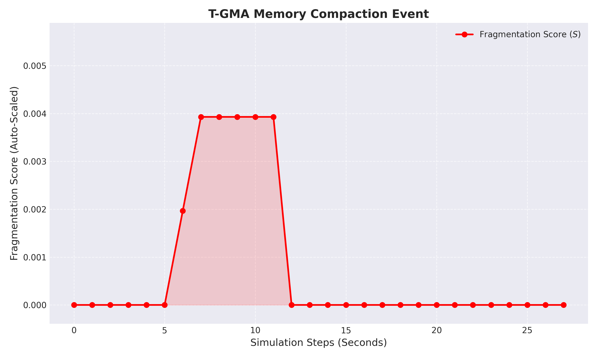

# 🚀 T-GMA: Thermal-Aware GPU Memory Allocator

A sophisticated, low-level GPU memory management engine that monitors GPU temperatures in real-time and performs **Active Memory Compaction** to cure external fragmentation and prevent thermal throttling. Built entirely on the NVIDIA CUDA Driver API (VMM) and NVML.

---


## 📌 Overview

Standard GPU memory allocation (`cudaMalloc`) abstracts away the physical location of data, leading to external fragmentation and thermal hotspots during massive ML workloads. When GPU temperatures spike, hardware throttles performance to survive.

**T-GMA** addresses this by decoupling Virtual Addresses from Physical VRAM. It implements an asynchronous watchdog that monitors hardware telemetry. When a thermal threshold is breached, the engine performs **Zero-Copy Remapping**—physically shifting scattered memory blocks into contiguous "cool zones" while leaving the application's virtual pointers completely intact.

---

## ✨ Core Features

* **Virtual Memory Decoupling** — Pre-allocates a static 1GB Virtual Address space and dynamically backs it with 2MB physical VRAM frames using `cuMemMap`.
* **Active Memory Compaction** — Detects fragmentation "holes" and physically shifts active tensors to close the gaps, reducing the fragmentation score to absolute zero.
* **Real-Time Thermal Telemetry** — Continuous hardware polling via the NVIDIA Management Library (NVML) on a detached watchdog thread.
* **Data Integrity Verification** — Guarantees mathematical accuracy; system proves that sentinels (e.g., `1337`) survive physical hardware migration.
* **Fragmentation Analytics** — Calculates real-time fragmentation ratios and exports telemetry to a CSV for automated Python dashboarding.
* **Thread-Safe Concurrency** — Utilizes `std::lock_guard<std::mutex>` to manage race conditions between the ML workload and the Watchdog engine.

---

## 🏗️ System Architecture

```text
┌─────────────────────────────────────────┐
│   T-GMA: High-Performance Engine        │
├─────────────────────────────────────────┤
│  Main Thread (Workload Simulator)       │
│  ├─ Tensor Allocation & Sentinel Write  │
│  ├─ Artificial Fragmentation (Hole Gen) │
│  └─ Data Integrity Audit                │
│                                         │
│  Watchdog Thread (Telemetry)            │
│  ├─ NVML Temperature Polling (1Hz)      │
│  └─ Compaction Trigger (>Threshold)     │
│                                         │
│  ThermalAllocator (VMM Core)            │
│  ├─ 1GB Static Virtual Hallway          │
│  ├─ cuMemMap / cuMemCreate              │
│  ├─ Zero-Copy DtoD Compaction           │
│  └─ CSV Fragmentation Logger            │
└─────────────────────────────────────────┘